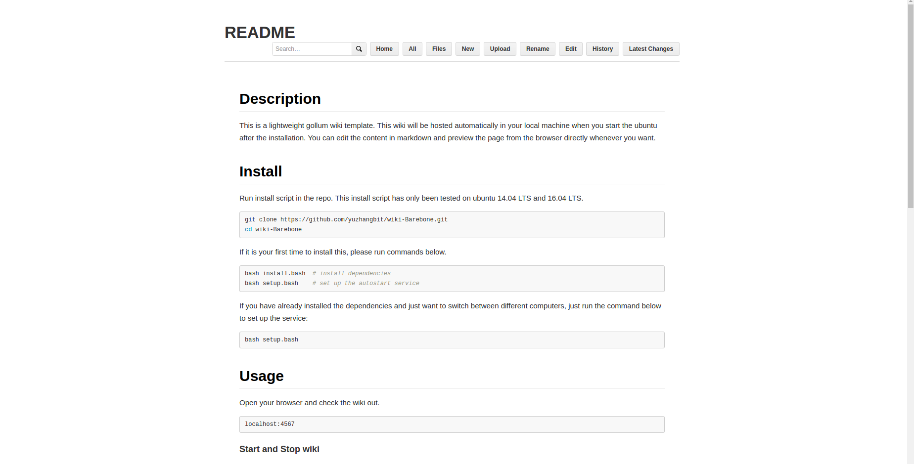
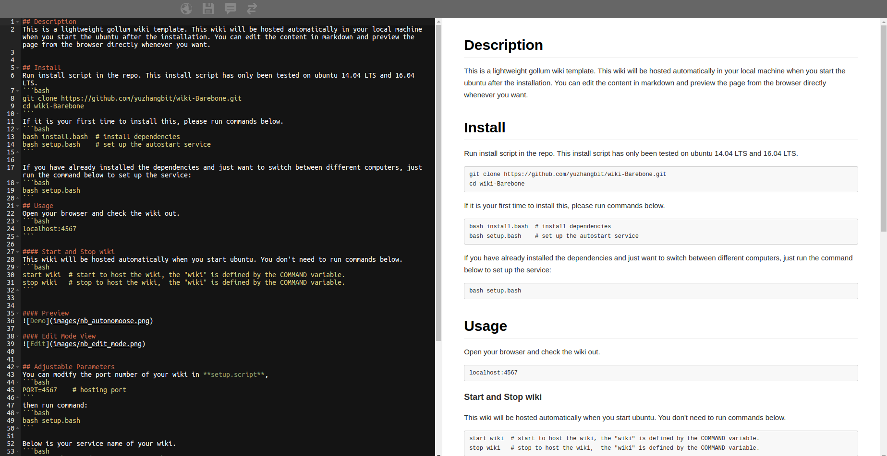

## Description
Welcome to IVRC wiki. This wiki will be hosted automatically in your local machine when you start the ubuntu after the installation. You can edit the content in markdown and preview the page from the browser directly whenever you want.


## Installation
Run the install script in the repo. This install script has only been tested on ubuntu 14.04 LTS and 16.04 LTS.
```bash
git clone https://github.com/yuzhangbit/wiki-Barebone.git
cd wiki-Barebone  
```
If it is your first time to install dependencies, please run commands below.  
```bash
bash install.bash  # install dependencies
bash setup.bash    # set up the autostart service
```    

If you have already installed the dependencies and just want to switch between different computers, just run the command below to set up the service:
```bash
bash setup.bash
```
## Usage
Open your browser and check the wiki out.
```bash
localhost:4567
```

#### Start and Stop wiki
This wiki will be hosted automatically when you start the ubuntu. You don't need to run commands below.
```bash
start wiki  # start to host the wiki, the "wiki" is defined by the COMMAND variable.
stop wiki   # stop to host the wiki,  the "wiki" is defined by the COMMAND variable.
```


#### Preview


#### Edit Mode View



## Adjustable Parameters
You can modify the port number of your wiki in **setup.script**,
```bash
PORT=4567    # hosting port
```
Then run the command:
```bash
bash setup.bash
```

Below is your service name of your wiki.
```bash
COMMAND=wiki   # default value is wiki
```


## The Gollum Configuration used by this repo:
```ruby
Gollum::Page.send :remove_const, :FORMAT_NAMES if defined? Gollum::Page::FORMAT_NAMES
wiki_options = {
  :live_preview => true,
  :allow_uploads => true,
  :per_page_uploads => true,
  :allow_editing => true,
  :css => true,
  :js => true,
  :mathjax => true,
  :h1_title => true,
  :emoji => true
}
Precious::App.set(:wiki_options, wiki_options)
```
