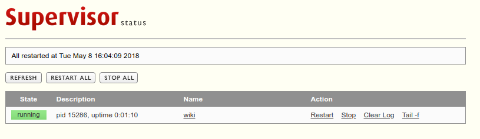

Description
-----------

Welcome to IVRC wiki. This wiki will be hosted automatically in your local machine when you start the ubuntu after the installation. You can edit the content in markdown and preview the page from the browser directly whenever you want.

Dependencies
------------

-	[rbenv](https://github.com/rbenv/rbenv) (ruby version manager, avoid messing up with the ruby comes with the system)
-	[bundler](https://github.com/bundler/bundler) (ruby application gem manager, install and update gems with ease)
-	[gollum](https://github.com/gollum/gollum) (wiki engine)
-	[supervisor](http://supervisord.org/) (Automatically host the wiki when the system starts, also provide a nice gui to control programs)

Installation
------------

Run the install script in the repo. This install script has only been tested on ubuntu 14.04 LTS and 16.04 LTS.

```bash
git clone https://github.com/yuzhangbit/wiki_barebone.git
cd wiki_barebone  
```

If it is your first time to install dependencies, please run commands below.

```bash
./install.sh  # install dependencies, rbenv, bundler, gollum, supervisor, enable the web gui for supervisor
./setup.sh    # set up the autostart configuration for the wiki app
```

If you have already installed the dependencies, make your wiki automatically start using commands below,

```bash
./setup.sh
```

Usage
-----

Open your browser and check the wiki out.

```bash
localhost:8888
```

#### Start and Stop wiki

This wiki will be hosted automatically when you start the ubuntu. You can control the program through commands below or web gui interfaces.

```bash
sudo supervisorctl start wiki     # start to host the wiki, the "wiki" is defined by the APP_NAME variable.
sudo supervisorctl restart wiki   # restart to host the wiki, the "wiki" is defined by the APP_NAME variable.
sudo supervisorctl stop wiki      # stop to host the wiki,  the "wiki" is defined by the APP_NAME variable.
```

#### Web gui to control the wiki app using the supervisor

Open your browser and run the command below.

```bash
localhost:9001
```

You can see the web gui for the supervisor to control the wiki app program.  


#### Preview


#### Edit Mode View


Adjustable Parameters
---------------------

You can modify the port number of your wiki in **setup.bash**,

```bash
PORT="8888"    # hosting port
```

Then run the command:

```bash
./setup.sh
```

Below is your service name of your wiki.

```bash
APP_NAME="wiki"   # default value is wiki
```

The Gollum Configuration used by this repo:
-------------------------------------------

```ruby
Gollum::Page.send :remove_const, :FORMAT_NAMES if defined? Gollum::Page::FORMAT_NAMES
wiki_options = {
  :live_preview => true,
  :allow_uploads => true,
  :per_page_uploads => true,
  :allow_editing => true,
  :css => true,
  :js => true,
  :mathjax => true,
  :h1_title => true,
  :emoji => true
}
Precious::App.set(:wiki_options, wiki_options)
```
